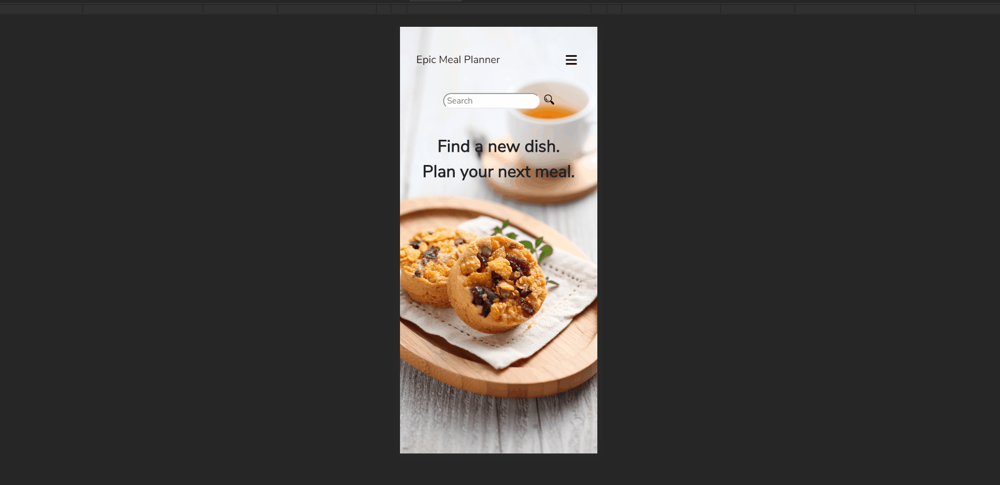

# Cheers & Beers

Cheers & Beers is a full stack e-commerce website that allows users to browse local craft beers, add them to cart, and place an order.

Please note that this is for demonstration purposes only.

## [Live Demo](https://http://epicmealplanner.jaehuh.network//)



## Getting Started

### Initial Setup

1. Fork this repo and clone your fork from the terminal.   

```$ git clone https://github.com/[user_name]/epicMealPlanner.git```

2. Navigate to, and open the `cheersAndBeers` directory, then install the necessary dependencies. 

``` $ npm install ```

3. Start a dev environment with Apache2 and MySQL
   * Make sure that the port is directed to ```3000```

   * Create a database in phpMyAdmin and import the `epic_meal_plan.sql` file

   * Create a new db_connections.php with your own credentials

4. Initiate the dev server 

``` $ npm run dev ```

5. Go to `localhost:3000` and enjoy!

## Contributing

Please feel free to fork this repo, make changes, submit pull requests, and send suggestions to jaehuh86@yahoo.com to make this app better.

## Built With

* JavaScript
* React
* Booststrap 4
* Reactstrap
* HTML5
* CSS3
* MySQL + phpMyAdmin
* PHP

## License
[MIT License](https://opensource.org/licenses/mit-license.php)
